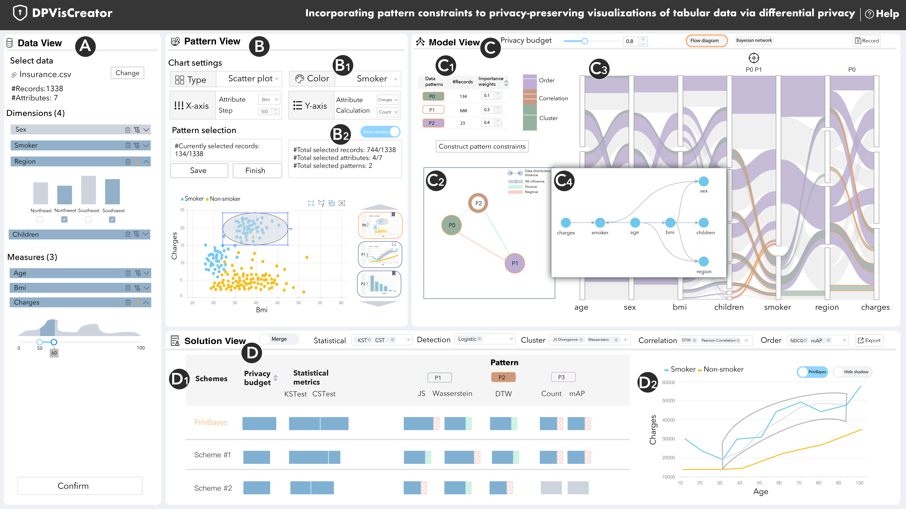

# DPVisCreator

Here is the official implementation of system prototype in paper _"DPVisCreator: Incorporating pattern constraints to privacy-preserving visualization via differential privacy"_.

We implemented the frontend and backend seprately. They could be found in the folder [`/front-end`](front-end/) and [`/back-end`](back-end/).

## Operating Instruction

- create virtual environment
  - conda create -n dpvis python=3.8
  - conda activate dpvis
- Run the backend locally
  - cd back-end
  - pip install -r requirements.txt
  - mkdir priv_bayes/out/
  - python manage.py runserver
- Run the frontend locally
  - cd front-end
  - npm install
  - npm start
